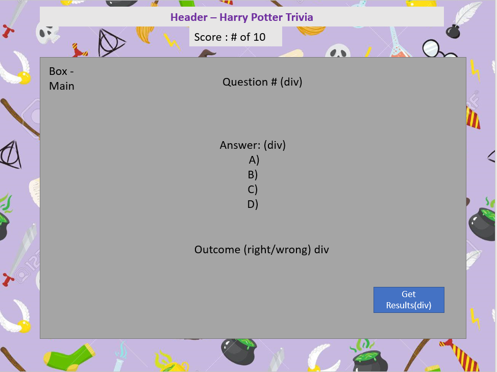

## Harry Potter Trivia Quiz || Margie Ball

### Link to the Game
[Harry Potter Trivia](https://margenta2.github.io/gameproject.github.io/)

### Description
This is a project is a trivia quiz to test one's knowledge of the Harry Potter books and movies. 

### Wireframe

### Features
#### Bronze
1. User can select an answer to each question.
2. User can click Get Results to see which answers were correct and get a total score.
3. The answers will change color based on user choice. Red is incorrect. Green is correct.
#### Silver (next phase)
1. Make quiz more interactive. Show each question individually. 
2. Use score to create pop up and tell user if they are a muggle/wizard.
#### Gold (future phase)
1. Add sound effects and animations

### Technologies Used
* Visual Studio Code
* Google Chrome Web Browser
* Google Chrome Developer Tools
* Command Line
* JavaScript
* CSS
* HTML

### My Process
1. I created a wireframe to show a simple quiz with questions, answers and a button for the score.
2. I started by Googling trivia games to understand what was out there for a simple quiz structure.
3. I used some of the sample code and started building. Using one function to house other functions was very helpful as well as using loops to iterate through the question and answer options.
4. Takeaways: I learned a lot during this project about JavaScript and how functions, loops and objects interact. There are so many different ways to accomplish one task. I also need to commit my changes more often.
5. My biggest struggle was making things in JS function. I still struggle to create code from the top of my head so using resources and input from the instructors and team mates really helped.

### Resources
In addition to various class resources I used various resources on Google to help me build this game. They include:
* [Simple Quiz Tutorial](https://simplestepscode.com/javascript-quiz-tutorial/)
* [Quiz Questions](https://simplestepscode.com/javascript-quiz-tutorial/)
* [Importing Fonts](https://stackoverflow.com/questions/7961721/how-do-i-install-a-custom-font-on-an-html-site)
* [Line Spacing](https://www.w3schools.com/cssref/pr_dim_line-height.asp)
* [Box Shadow](https://www.w3schools.com/cssref/css3_pr_box-shadow.asp)
* [For In Loops](https://www.javascripttutorial.net/javascript-for-in/Quiz)
* [Background Images](https://css-tricks.com/almanac/properties/b/background-repeat/)
* And of course the help of my gracious instructors: Leo, David and Casey.
